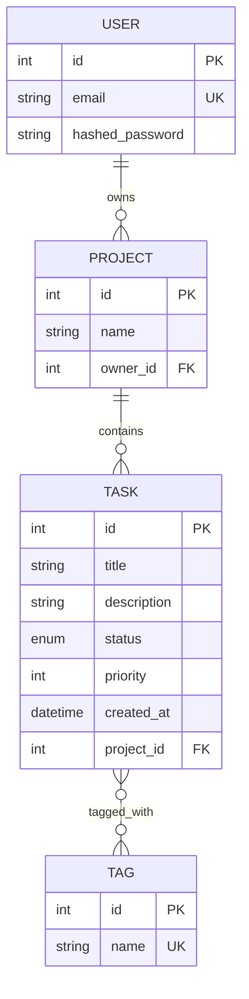

# Task Manager API

[](https://github.com/ArtemGoncharov2004/Task-Manager-API/actions/workflows/ci.yml)


REST API для управления задачами и проектами с авторизацией, построенный как учебный pet-проект для демонстрации бэкенд-стека на Python.

Пользователь регистрируется, создаёт проекты, а внутри них — задачи с приоритетом, статусом и тегами. Доступ к проектам и задачам ограничен владельцем.

## Стек

- **Python 3.12**
- **FastAPI** — веб-фреймворк, асинхронные роуты
- **PostgreSQL 16**
- **SQLAlchemy 2.0** (async, `asyncpg`) — ORM
- **Alembic** — миграции БД
- **Pydantic v2** / `pydantic-settings` — валидация и конфигурация
- **PyJWT + bcrypt** — аутентификация по JWT
- **pytest, pytest-asyncio, httpx** — тестирование (async HTTP-клиент поверх ASGI, без реального сервера)
- **Docker / docker-compose** — multi-stage сборка, healthcheck, автоприменение миграций при старте
- **GitHub Actions** — CI: линт (`ruff`), тесты с Postgres в service container, сборка Docker-образа
- **ruff** — линтинг и сортировка импортов

## Возможности

- Регистрация и JWT-авторизация (`/auth/register`, `/auth/login`)
- CRUD проектов и задач, с проверкой владения (403 на чужие ресурсы)
- Пагинация (`skip`/`limit`) и фильтрация задач по статусу и проекту
- Теги задач — связь многие-ко-многим, с проверкой уникальности имени (409 на дубликат)
- Единый формат ошибок через кастомные исключения (401 / 403 / 404 / 409 / 422)
- Асинхронный доступ к БД на всём пути запроса

## Схема БД



## Быстрый старт

```bash
git clone https://github.com/ArtemGoncharov2004/Task-Manager-API.git
cd Task-Manager-API
cp .env.example .env
docker compose up --build
```

При старте `app` автоматически применяет Alembic-миграции, затем поднимает сервер. API будет доступен на:

- Swagger UI: http://localhost:8000/docs
- Healthcheck: http://localhost:8000/health

Остановить и удалить контейнеры вместе с данными:

```bash
docker compose down -v
```

## Переменные окружения

Файл `.env` (создаётся из `.env.example`):

| Переменная | Описание |
|---|---|
| `DATABASE_URL` | строка подключения к Postgres (используется приложением вне Docker; внутри compose переопределяется на `db:5432`) |
| `TEST_DATABASE_URL` | строка подключения к отдельной тестовой БД |
| `SECRET_KEY` | секрет для подписи JWT — сгенерировать: `python -c "import secrets; print(secrets.token_hex(32))"` |
| `ALGORITHM` | алгоритм подписи JWT (по умолчанию `HS256`) |
| `ACCESS_TOKEN_EXPIRE_MINUTES` | время жизни access-токена в минутах |

## Структура проекта

```
.
├── docker-compose.yml
├── .env.example
├── .github/workflows/ci.yml       # lint → test → docker-build
└── src/
    ├── app/
    │   ├── api/                   # роуты (auth, projects, tasks, tags)
    │   ├── core/                  # конфиг, security, exceptions
    │   ├── db/                    # engine, session, Base
    │   ├── models/                # SQLAlchemy-модели
    │   ├── schemas/                # Pydantic-схемы
    │   └── services/               # бизнес-логика
    ├── alembic/                    # миграции БД
    ├── tests/                      # pytest + httpx + async fixtures
    ├── Dockerfile                  # multi-stage сборка
    ├── entrypoint.sh               # alembic upgrade → uvicorn
    ├── pytest.ini
    ├── pyproject.toml              # конфиг ruff
    └── requirements.txt
```

## API

Основные группы эндпоинтов (полная интерактивная документация — в Swagger на `/docs`):

| Группа | Эндпоинты |
|---|---|
| Auth | `POST /auth/register`, `POST /auth/login` |
| Projects | `GET/POST /projects`, `GET/PATCH/DELETE /projects/{id}` |
| Tasks | `GET/POST /tasks` (фильтры `status`, `project_id`, пагинация), `GET/PATCH/DELETE /tasks/{id}` |
| Tags | `GET/POST /tags`, `GET/DELETE /tags/{id}` |

Все эндпоинты `projects` и `tasks` требуют JWT (`Authorization: Bearer <token>`) и ограничены владельцем ресурса.

## Тесты

Проект использует отдельную тестовую БД и async-фикстуры (`httpx.AsyncClient` поверх ASGI-приложения, без реального сервера).

Локально (при поднятом `db` из docker-compose):

```bash
docker compose up -d db
docker compose exec db psql -U task_user -d task_manager -c "CREATE DATABASE task_manager_test;"

cd src
pip install -r requirements.txt
pytest -v
```

Отчёт покрытия после прогона — в `src/htmlcov/index.html`.

В CI тесты запускаются с Postgres в виде GitHub Actions service container — см. `.github/workflows/ci.yml`.

## CI/CD

На каждый push и pull request в `main` запускается workflow из трёх шагов:

1. **lint** — `ruff check`
2. **test** — `pytest` с реальным Postgres (service container)
3. **docker-build** — проверка, что `Dockerfile` успешно собирается

## Возможные улучшения

- Защита эндпоинтов `/tags` авторизацией (сейчас доступны без токена)
- Refresh-токены вместо единственного access-токена
- Деплой на Render / Fly.io
- Rate limiting
